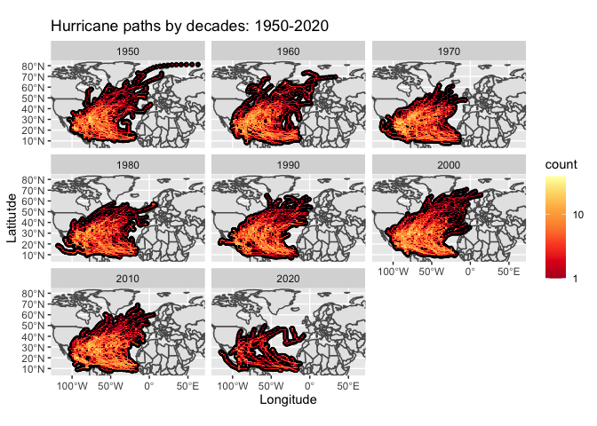

Case Study 09
================
Collin O’Connor
August 1, 2020

<!-- -->

| state          | storms |
| :------------- | -----: |
| Florida        |     82 |
| North Carolina |     62 |
| Georgia        |     57 |
| Texas          |     53 |
| Louisiana      |     49 |

Unique Hurricanes per State (1950 - 2020)
