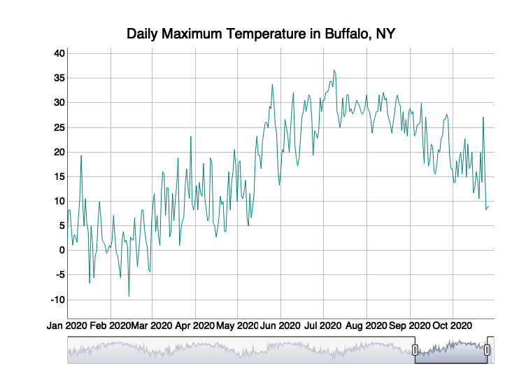
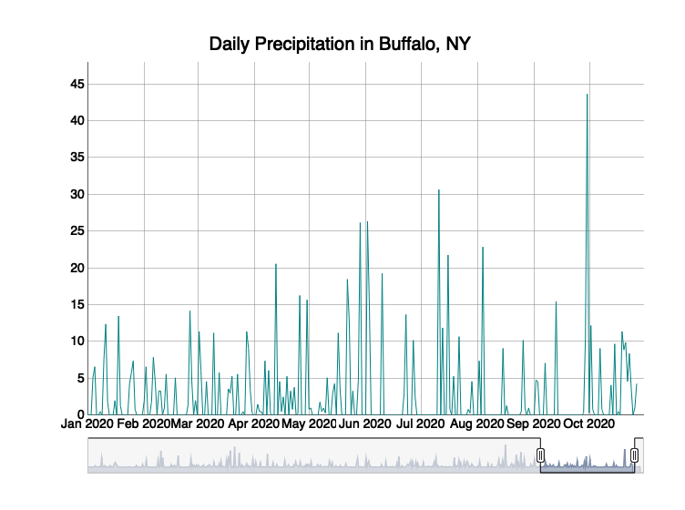

Case Study 12
================
Your Name
August 1, 2020

``` r
library(dplyr)
```

    ## 
    ## Attaching package: 'dplyr'

    ## The following objects are masked from 'package:stats':
    ## 
    ##     filter, lag

    ## The following objects are masked from 'package:base':
    ## 
    ##     intersect, setdiff, setequal, union

``` r
library(ggplot2)
library(ggmap)
```

    ## Google's Terms of Service: https://cloud.google.com/maps-platform/terms/.

    ## Please cite ggmap if you use it! See citation("ggmap") for details.

``` r
library(htmlwidgets)
library(widgetframe)
library(rnoaa)
```

    ## Registered S3 method overwritten by 'hoardr':
    ##   method           from
    ##   print.cache_info httr

``` r
library(xts)
```

    ## Loading required package: zoo

    ## 
    ## Attaching package: 'zoo'

    ## The following objects are masked from 'package:base':
    ## 
    ##     as.Date, as.Date.numeric

    ## 
    ## Attaching package: 'xts'

    ## The following objects are masked from 'package:dplyr':
    ## 
    ##     first, last

``` r
library(dygraphs)
```

``` r
d=meteo_tidy_ghcnd("USW00014733",
                   date_min = "2016-01-01", 
                   var = c("TMAX"),
                   keep_flags=T) %>% 
   mutate(date=as.Date(date),
          tmax=as.numeric(tmax)/10) #Divide the tmax data by 10 to convert to degrees.
```

    ## using cached file: /Users/collinoconnor/Library/Caches/R/noaa_ghcnd/USW00014733.dly

    ## date created (size, mb): 2020-11-23 15:18:49 (8.433)

    ## file min/max dates: 1938-05-01 / 2020-11-30

``` r
d2=xts(d$tmax,order.by = d$date)
```

``` r
g1=dygraph(d2,
        main = "Daily Maximum Temperature in Buffalo, NY")
  dyRangeSelector(g1,dateWindow = c("2020-01-01", "2020-10-31"))
```

<!-- -->

``` r
p=meteo_tidy_ghcnd("USW00014733",
                   date_min = "2016-01-01", 
                   var = c("PRCP"),
                   keep_flags=T) %>% 
   mutate(date=as.Date(date),
          prcp=as.numeric(prcp)/10)
```

    ## using cached file: /Users/collinoconnor/Library/Caches/R/noaa_ghcnd/USW00014733.dly

    ## date created (size, mb): 2020-11-23 15:18:49 (8.433)

    ## file min/max dates: 1938-05-01 / 2020-11-30

``` r
p2=xts(p$prcp,order.by = p$date)
```

``` r
h1=dygraph(p2,main = "Daily Precipitation in Buffalo, NY")
  dyRangeSelector(h1,dateWindow = c("2020-01-01", "2020-10-31"))
```

<!-- -->

``` 
```
